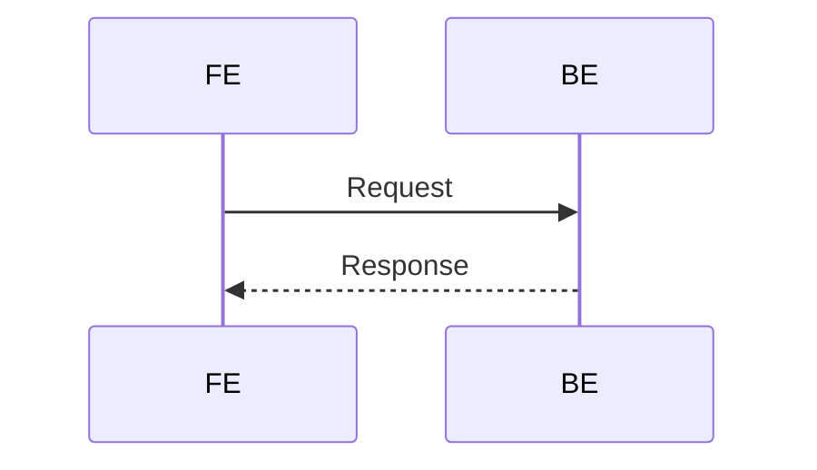
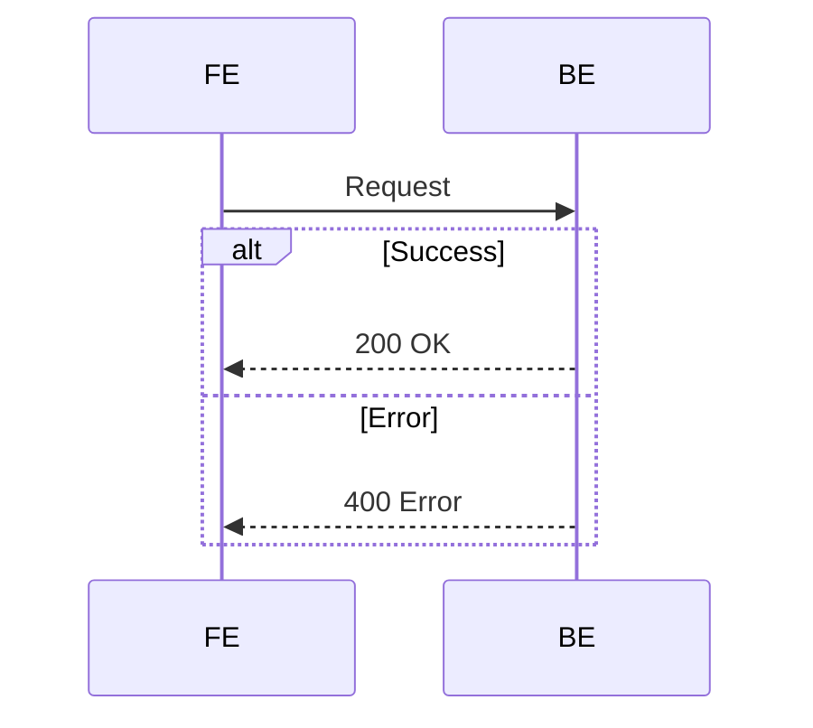
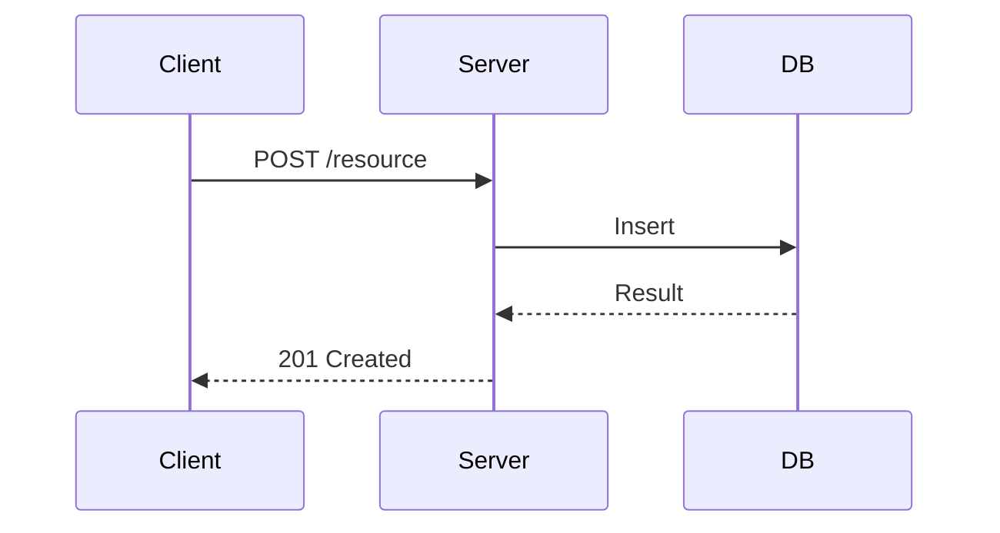
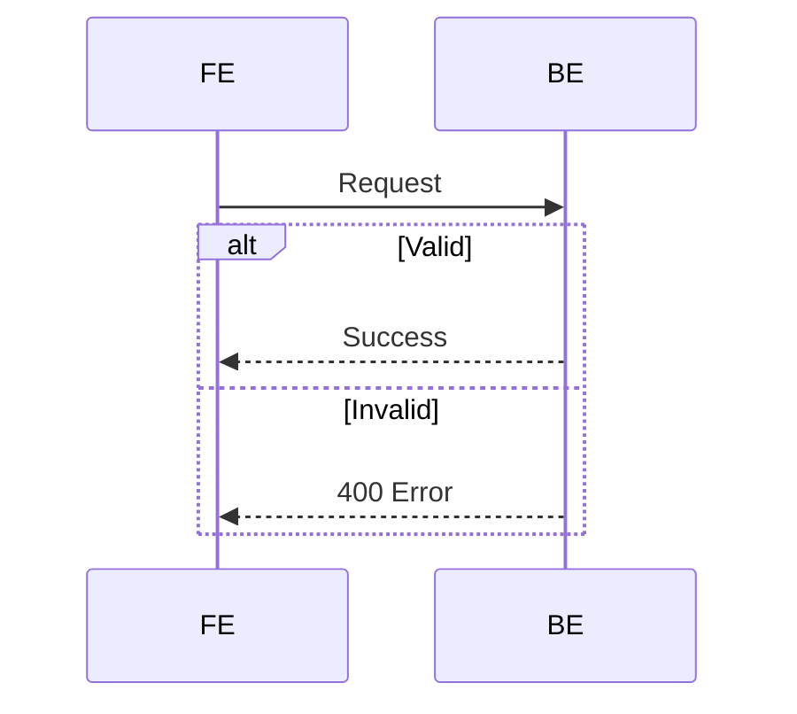
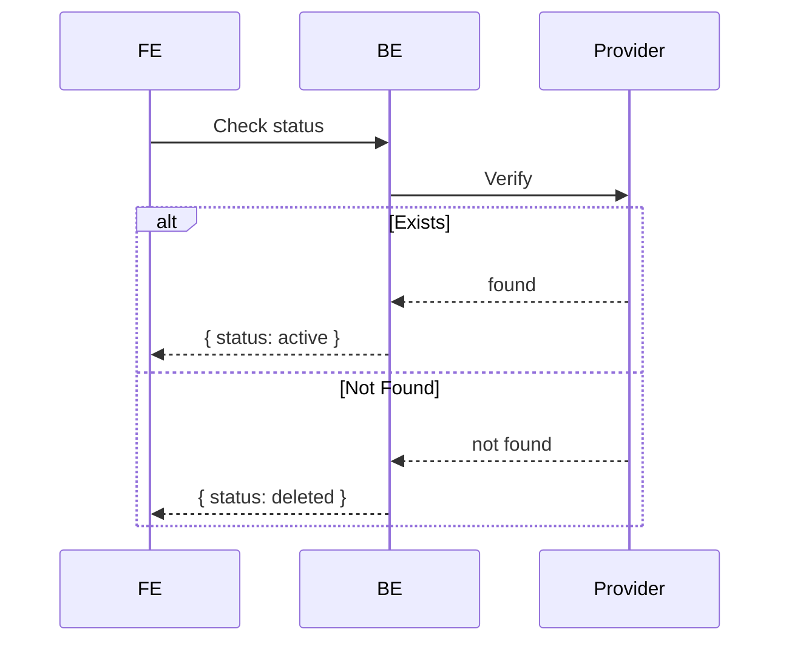

# Mermaid Diagram Writing

## Core Rules

### 1. Keep Diagrams Simple

Avoid colored rectangles and complex styling. Use `theme: base` or let renderers use their default minimal style.

### 2. Prefer Many Small Diagrams Over One Big Diagram

**Bad** - One large diagram trying to show everything:
```mermaid
sequenceDiagram
    participant A
    participant B
    participant C
    participant D
    participant E
    A->>B: 1
    B->>C: 2
    C->>D: 3
    D->>E: 4
    -- lots more steps --
```

**Good** - Multiple focused diagrams:


### 3. Diagram Scope Guidelines

- **Max 4-5 participants** per diagram
- **Max 10-15 messages** per sequence diagram
- Each diagram should tell one coherent story

### 4. Participant Naming

- Use short, clear names: `FE`, `BE`, `DB`, `Provider`, `User`
- Avoid: `FrontendApplication`, `BackendService`

### 5. Use Structured Flow Control

Leverage `alt`/`else`, `loop`, and `opt`:



### 6. Consistent Message Patterns

- **Queries**: `Source->>Target: Action`
- **Responses**: `Target-->>Source: Result`

### 7. Label Everything

- Always label `alt`/`else` blocks
- Include status codes when relevant

## Common Patterns

### API Endpoint


### Error Handling


### Conditional Flow


## When to Split

- More than 5 participants
- More than 15 messages
- Multiple unrelated flows mixed together
